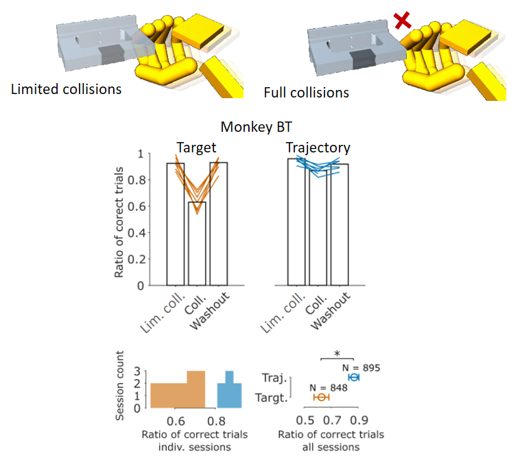
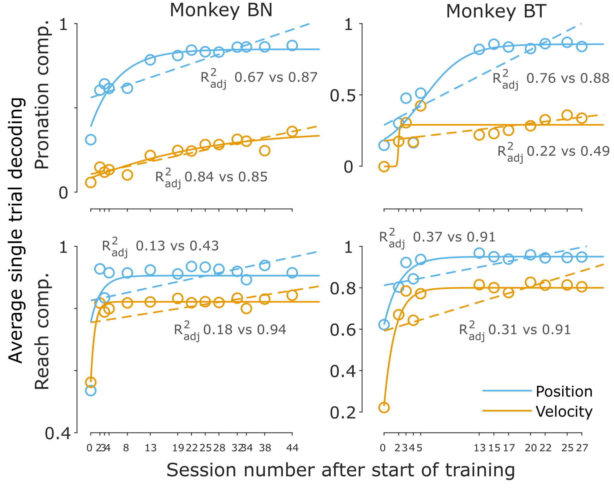
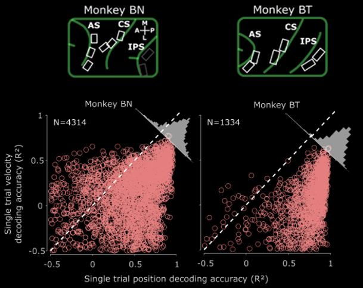

## 1
Controlling a hand prosthesis X through a brain interface is an incredibly hard problem.

How to train a BCI to produce accurate grasp movements? 

We present ProXYZ: a protocol to train accurate BCI grip control.

A 🧵 from our new preprint! (url)

## 2
It all began with a specific question: can we apply existing, high performance methods (e.g. @gilja @paul ReFIT or @david RNNs), to train a grasp BCI? ReFIT, for example, boosts performance with a simple trick: retrain with velocity vectors rotated to target

## 3
The problem? Implementing RNN and ReFIT out of the box, in our case, not only failed, it failed bad. Subjects were not able to control joint velocitiy and RNNs worked fine offline but misserably online.

## 4
What happened? Our initial guess was that hand movements could be consider an extension of arm reaches. However, once we went deep into it, we realized that the problem of grasping is actually quite different.

## 5
After trial and error, and years of tests, we suggest BCI grasping control is particular in 3 key aspects:
- It is essentially a data problem
- The control space is curved
- Hand area signals seem to be different

## 6
To address these aspects, we developed ProXYZ. It comprises 4 compoments:
- C1.Build a kinematic latent space
- C2.Train degrees of freedom incrementally
- C3.Retrain with a fit-to-trajectory strategy
- C4.Improving the latent space mapping with a two layer RNN called NARX

## 7
Together, these strategies bring some sweet and accurate hand prosthesis control our monkeys quite liked (at least as we can tell from metrics such as task performance and trajectory accuracy). Here an example, using our online MuJoCo physics environment.

## 8
Why do we believe grasping is a data problem? Given the high number of degrees of freedom in hand control, only data capture methods can help describe the kinematic space that needs to be traversed to achive the myriad of possible hand configs.

## 9
We used a full arm and hand tracking system to capture real grasps. Doing so, made us realize for example that the state switching in the joint latent space traverses a curved trajectories.

## 10
Given this space, how to train decoders that map neural act. to such trajectories? Here C3 plays an important role. Instead of reaching to a specific targets, we extended ReFIT to consider trajectories.

## 11
Considering trajectories is helpful during hand state transitions as they can prevent collisions (e.g. with own fingers or to quickly prepare the hand). Fit-to-trajectory improves accuracy and helps control in an environment with collisions.

## 12
In this initial work, we focused on the two core grip types: power and precision (were a going to do more soon!). Would our stategy extend to more grip types and latent dimensions? Using our RNN models, we showed we can go upto 12 dimensions and 27 grip types.

## 13
What about Component 2? To achieve maximum accuracy and full control of the latent DOFs, we trained our subjects from scratch and prevented native hand movements, requiring a new neural latent space to emerge.

## 14
To train this, we went from basic grasping to full wrist control and then to grip switching. Interestingly, the task seemed to get easier as we incresed the complexity. Why? we still don't know, we are hoping to look at what happened in that data soon!

## 15
A big open question for us was, why didn't velocity control (which has been extensively used before) worked in our case? It turns out, area differences might be playing a role. For example, during training of the BCI, position evolved faster than velocity control.

## 16
This is in contrast to velocity control, which seems to be dominant in arm reach related areas (see for example @james work). We confirmed that during real grasps, position information dominated (yes: we implanted in hand ctrl areas).

## 17
Our approach is a method to improve control accuracy. But just as we gain hand dexterity learning different skills, full BCI hand control will likely require different protocols. Our tiny contribution can complement other excellent training approaches such as those from @(other hand BCI people).

## 18
There are tons of details we had to leave out here, for more information check out our preprint!. Thanks for hanging on on this long thread and thanks too to the amazing people that has inpired this work over the years (@other relevant people.)
